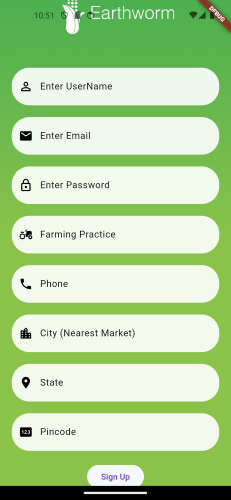
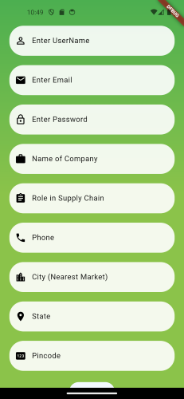
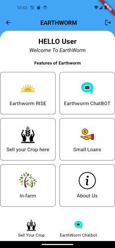
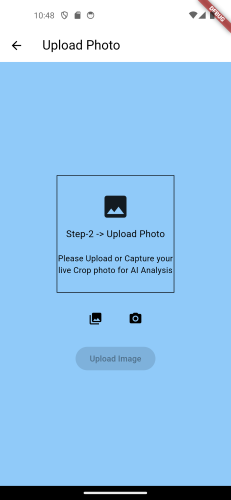
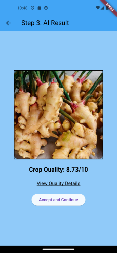
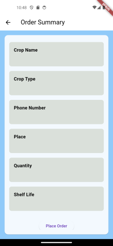
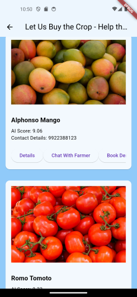
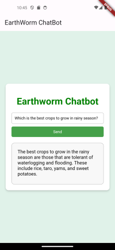
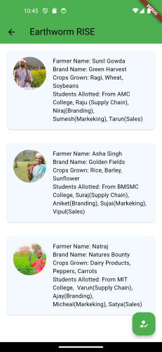

# Project Earthworm

Welcome to project Earthworm.

"Earthworm, the best friend of farmer ~ project Earthworm"

this is a application which provide connection between
farmer and a large quantity agriculture product buyer, the main theme of this project is to save life of our nation back bone "farmer" from being corrupted, from the middleman of APO market.

# Introduction:

One of the biggest barriers for farmers is the low prices paid by middlemen who control their produce in the supply chain. Taking undue advantage of the inadequate knowledge of farmers regarding the current market prices and practices, the agents offer them extremely low prices.

To eradicate such barriers we need to establish a direct connection between a farmer and a buyer. So don't worry to resolve this problem we introduce you the Project Earthworm the application named "**Earthworm**"

To know more about the problem coused by midldeman in **_APMC_** market you can read the article published by **gulfnews**. [click here to open the article](https://gulfnews.com/world/asia/india/how-middlemen-exploit-farmers-in-india-1.74209558)

# Features

**Mainly, Project Earthworm is focused on a B2B business model where agricultural produce will be sold to large quantity buyers like Agri sector Industry , Hotel , Walmart and so on.**

**_Some of the exciting features of Earthwarm are:_**

- User friendly interface.
- Here the farmer can sell the produce with easy three steps.

  - Fill the crop details.

  - upload the photo and verify your detail.

  - place the order.

- Customised Earthworm **chatbot**.
- Buyer can check the verifed agriculture produce and place the order

- Leanding of small finance.
- Healthy customer servises.

# Prerequisites

Make sure you have the following installed before proceeding:

- [VS Code](https://code.visualstudio.com/)
- [Flutter](https://flutter.dev/docs/get-started/install)
- [Android Studio](https://developer.android.com/studio)

## Installation

### VS Code

1. Install VS Code from [here](https://code.visualstudio.com/).
2. Open VS Code.
3. Install required extensions:
   - Dart
   - Flutter

### Flutter

1. Install Flutter from [here](https://flutter.dev/docs/get-started/install).
2. Run flutter doctor to ensure everything is set up correctly.

#### **Configuration of flutter**

Make sure you using this stable version.

- Flutter 3.16.9 • channel stable • [reffer here](https://github.com/flutter/flutter.git)
- Framework • revision 41456452f2 (3 weeks ago) • 2024-01-25 10:06:23 -0800
- Engine • revision f40e976bed
- Tools • Dart 3.2.6 • DevTools 2.28.5

### Android Studio AVD

1. Install Android Studio from [here](https://developer.android.com/studio).
2. Open Android Studio and set up an Android Virtual Device (AVD) using the AVD Manager.

## Usage

- Clone/download the earthworm file from github repo https://github.com/RohithKrishna27/Project_Earthworm_Farmer_Buyer_platform.git
- Priorly open Android Virtual Device (AVD) in the window.
- Enter the command **_flutter pub get_** in the vs code terminal.
- After that Enter **_flutter run_** in your vs code terminal.
- If you face any issue first run **_flutter doctor_** and the follow with flutter pub get and run
- And , there you find your virtual device (emulator).

## **Registration process**
  

If you are a farmer register as a farmer or else register as a buyer.

  
  

- ### **How to Sell the crop. ? (farmer)**

  1. first you will be finding our user friendly interface.

     

  2. Click on "Sell your crop" and you will directed ->

     

  3. Fill the required details of your produce.
  4. Take the photo pf your argriculture produce. And upload to our application ,like -->

  

  5. After uploading the image our AI will verify your crop

     condition and quality,example.

     

  6. Click on Accept and continue.
  7. you will directed to your order summary , verify it and place the order.

     

     **_Place the order_**

* ### **How to place the order. ? (Buyer)**

  1. click on the place your order section in the home page.

     

  2. you will be directed to order section wher you can view the multiple agri produce placed by the farmer , you can verify the detail of the crop and book a demo.

      

## Additional Facility

- **_Earthwarm Chatbot_**

  customised AI chatbot bult using google technologies , helps to clear the quiry related to any sectors

  

  Credits to **_Romin Irani_** Google developer associate.

  https://codelabs.developers.google.com/llm-chat-app-flask#5

  click on chatbot to access earthworm chatbot code [chatbot](../../../../Downloads/run/Project_Earthworm_Farmer_Buyer_platform-main/lib/WeView/WebViewScreen.dart)

* **_Earthworm Rise_**

  Initiative to introduce farmer to the B2C Business model of the market by building their own brand with help of volunteer student

  

* **_In-Farm_**

  provides farmer with latest news about agriculture technology , government scheme and farming related news .

  

* **_Earthworm Finance_**

  Where farmer will be lended with small finance but this is in under developement , it will be developed further.

   

## **API** used in the project

### Cloud Vision API

| Description               | Documentation Link                                  |
|---------------------------|------------------------------------------------------|
| Provides image recognition| [Cloud Vision API Documentation](https://cloud.google.com/vision/docs) |

### Firestore API

| Description                   | Documentation Link                                     |
|-------------------------------|---------------------------------------------------------|
| Cloud-based NoSQL database    | [Firestore API Documentation](https://cloud.google.com/firestore/docs/reference/rest)   |

 ## API used in Earthworm Chatbot

### **AI Platform API**

| Description                                                                                                                       | Documentation Link                                        |
| --------------------------------------------------------------------------------------------------------------------------------- | --------------------------------------------------------- |
| Manages and deploys machine learning models . This API is used for managing and deploying machine learning models on Google Cloud | [AI Platform API Documentation](https://cloud.google.com/ai-platform/docs) |

### **Google Cloud Storage API**

| Description                                                                                                                                | Documentation Link                                             |
| ------------------------------------------------------------------------------------------------------------------------------------------ | -------------------------------------------------------------- |
| Programmatic access to GCS . This API provides programmatic access to Google Cloud Storage, a scalable and durable object storage service. | [Google Cloud Storage API Documentation](https://cloud.google.com/storage/docs/apis) |

### **Cloud Logging API**

| Description                                                                                                                                 | Documentation Link                                      |
| ------------------------------------------------------------------------------------------------------------------------------------------- | ------------------------------------------------------- |
| Stores, searches, and analyzes logs . This API allows you to store, search, and analyze logs generated by your applications on Google Cloud | [Cloud Logging API Documentation](https://cloud.google.com/logging/docs/reference/v2/rest) |

### **Cloud Run API**

| Description                                                                                                                                         | Documentation Link                                    |
| --------------------------------------------------------------------------------------------------------------------------------------------------- | ----------------------------------------------------- |
| Deploys and manages containerized applications . This API enables you to deploy and manage containerized applications that are automatically scaled | [Cloud Run API Documentation](https://cloud.google.com/run/docs) |

### **Cloud Build API**

| Description                                                                                                | Documentation Link                                        |
| ---------------------------------------------------------------------------------------------------------- | --------------------------------------------------------- |
| Builds and tests applications on GCP . This API allows you to build and test applications on Google Cloud. | [Cloud Build API Documentation](https://cloud.google.com/build/docs/api/reference/rest) |

# **Conclusion**

# Project Earthworm - Prototype Release

Thank you for being a part of Project Earthworm, our initiative to revolutionize the connection between farmers and larger markets. As we release this prototype, we appreciate your understanding and welcome your support in identifying and reporting any bugs or issues you may encounter.

## Purpose:

Project Earthworm aims to empower farmers, enhance market accessibility, and contribute to the Sustainable Development Goal of "Zero Poverty."

## Prototype Stage:

This release represents an early stage in our development process. Expect occasional bugs, and we appreciate your patience and collaboration as we work towards refining and improving the platform.

## How to Report Bugs:

If you encounter any issues, please report them through our email [Rohith](rohithkrishna72726@gmail.com) or [Goutham](gouthampreetham567@gmail.com). Your feedback is invaluable in shaping a robust and user-friendly solution.

## Our Vision:

We envision Project Earthworm as a catalyst for positive change in the agricultural sector. Your involvement and support are crucial in realizing this vision.

Thank you for being a part of this journey. Together, let's make a meaningful impact and pave the way for a more sustainable and equitable future.

Best regards,
